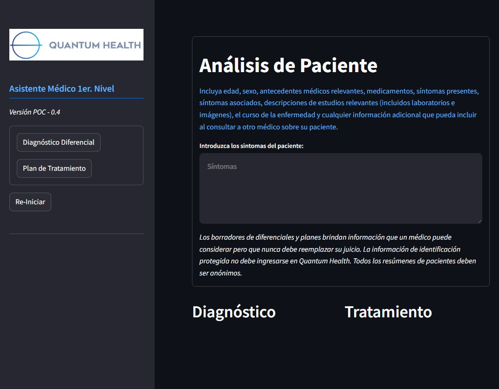

# Asistente Médico
### Prueba de Concepto "POC"  - ***Quantum Health***  
  

  

## Descripción
Esta es una Prueba de Concepto (POC)  para el desarrollo de un asistente médico con AI con los siguientes elementos: 
- **Síntomas del paciente**: Como datos de entrada, Incluya edad, sexo, antecedentes médicos relevantes, medicamentos, síntomas presentes, síntomas asociados, descripciones de estudios relevantes (incluidos laboratorios e imágenes), el curso de la enfermedad y cualquier información adicional que pueda incluir al consultar a otro médico sobre su paciente. 
- **Diagnóstico**: Es el resultado que produce la aplicación en base a los síntomas del paciente. Se utiliza como datos de referencia (RAG) el diccionario médico Webster's New World
- **Tratamiento**: Es el resultado que produce la aplicación que sugiere el tratamiento indicado para el paciente en base a los síntomas y el diagnóstico.

 

La prueba de concepto del Asistente Médico para Soporte a la decisión (CDS) está diseñada para mejorar los procesos de toma de decisiones clínicas de los médicos. El POC CDS genera borradores de diagnósticos diferenciales, evaluaciones y planes, y respuestas a preguntas de referencia clínica. Las funciones principales disponibles de la plataforma no están diseñadas ni deben usarse para adquirir, procesar o analizar imágenes médicas, señales de dispositivos de diagnóstico in vitro o patrones o señales de sistemas de adquisición de señales.

## Limitaciones
Las respuestas de AI CDS proporcionan la base para sus recomendaciones específicas para una revisión independiente por parte del usuario médico. Nuestras respuestas de IA son recomendaciones o recomendaciones en forma de borradores que el usuario médico debe revisar en detalle. Las funciones principales disponibles de nuestra plataforma AI CDS solo deben usarse como complemento del razonamiento médico y nunca reemplazar ni reemplazar el juicio de un médico. Las pruebas clínicas y la optimización de la versión actual de nuestra plataforma revelaron limitaciones del AI CDS, particularmente en su manejo de escenarios clínicos en los ámbitos de obstetricia y ginecología, pediatría, endocrinología y cuidados paliativos. Nuestra validación de esta versión de nuestra plataforma reveló limitaciones en el manejo de cuestiones endocrinológicas por parte de AI CDS, cálculos estadísticos complejos, toma de decisiones compleja y matizada en condiciones de incertidumbre, cuestiones legales clínicas/éticas complejas, toma de decisiones compleja centrada en el paciente, presentaciones psiquiátricas complejas, planificar y evaluar iniciativas de mejora de la calidad y la seguridad del paciente, y la identificación del contexto social subyacente como un factor que contribuye al razonamiento del diagnóstico y a la determinación de los próximos pasos en la gestión. Nuestro equipo de Quantum Health continúa desarrollando la plataforma teniendo en cuenta estas limitaciones actuales para lograr nuestra misión de capacitar a los médicos con el mejor CDS de IA de su clase y mejorar los resultados de los pacientes en todo el mundo.

Los modelos de lenguaje grande tienen limitaciones inherentes, incluida la capacidad de perpetuar los sesgos del preentrenamiento y ajuste de modelos de lenguaje grande y los sesgos introducidos por las entradas del usuario. Aunque en la pureba de concpeto se han realizado importantes esfuerzos para eliminar la capacidad del modelo de perpetuar sesgos dañinos, al servicio de nuestra dedicación para garantizar la seguridad, la equidad y la alineación en el despliegue de AI CDS en todo el mundo, en este momento recomendamos la omisión de cualquier elemento de un escenario clínico relacionado con el manejo de raza, etnia, orientación sexual, género, estatus socioeconómico, discapacidades, edad, ubicación geográfica e idioma y antecedentes culturales cuando se utiliza nuestro AI CDS. La eliminación de la perpetuación de sesgos al utilizar un modelo de lenguaje amplio y garantizar que la IA sirva para ayudar a acelerar el logro de la equidad en salud son elementos centrales de la misión de Quantum Health.

La prueba de conpceto POC para Quantum Health AI CDS no está expresamente destinada a ser utilizada por pacientes. Los usuarios no deben utilizar este modelo para consejos de salud personal o como sustituto de una consulta médica profesional. Esta plataforma ofrece recomendaciones a los médicos que les ayudan en la toma de decisiones clínicas, y las respuestas de IA a menudo requieren la experiencia de un médico para interpretar las respuestas, que a menudo consideran una amplia gama de diagnósticos potenciales, opciones de diagnóstico y opciones terapéuticas como parte de un ejercicio de análisis probabilístico. razonamiento clínico.

## Aplicación
- Código:  Pyhton
- Plataforma de aplicación:  Streamlit
- PLataforma de AI: OpenAI Assistant
- Infraestructura de servicios:  EC2 - AWS
- Aplicación: [POC - Asistente Médico](http://qhealth.homeip.net:8501/) 

 
